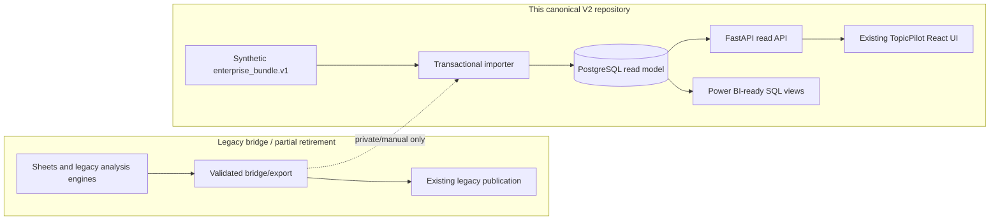
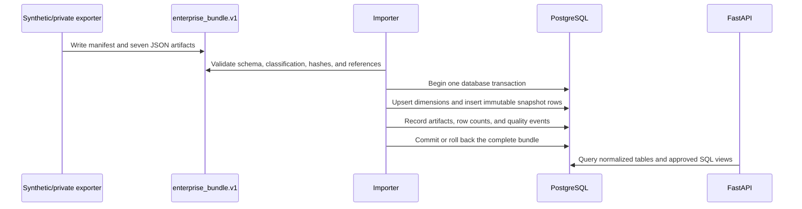

# TopicPilot Platform

[](https://github.com/Xiezhou0828/topicpilot-platform/actions/workflows/ci.yml)
[](https://topicpilot-platform.game0962046460.chatgpt.site/)

**[Open the public synthetic-data demo](https://topicpilot-platform.game0962046460.chatgpt.site/)**

TopicPilot Platform is a public, synthetic-data portfolio implementation of a
Taiwan-market Theme Intelligence read platform. It demonstrates how a
spreadsheet-era workflow can be evolved toward PostgreSQL, FastAPI, and React
with explicit contracts, evidence, and controlled coexistence.

> **Demo data only:** every fixture in this repository is synthetic. The UI and
> API are educational software demonstrations, not financial advice, trading
> signals, or a source of live market data.

The hosted portfolio is intentionally a clearly labelled synthetic-data demo;
it is not a live-market fallback or a promise of hosted Production data. The
FastAPI-to-PostgreSQL path is exercised locally through Docker Compose and CI,
while non-public runtime data and credentials remain outside this repository.

## Current operational note

This README is public-facing and intentionally avoids internal task history.
For the current 2026-08-14 project state and handoff, use
[PROJECT_CONTEXT.md](PROJECT_CONTEXT.md), the [execution roadmap](docs/ROADMAP.md),
and the [high-level product roadmap](docs/product/TOPICPILOT_PRODUCT_ROADMAP.md).
Those documents are the current navigation/status authorities; task reports and
old handoffs are evidence of what happened, not parallel current versions.

## What this project demonstrates

- A PostgreSQL 16 read model with versioned Alembic migrations.
- Transactional, hashed, and idempotent `enterprise_bundle.v1` ingestion.
- Read-only FastAPI endpoints with generated OpenAPI documentation.
- The original React and TypeScript TopicPilot frontend, with only its shared
  data-access layer redirected from R2/JSON to FastAPI/PostgreSQL.
- Docker Compose orchestration for database, migrations, seed, API, and web.
- CI checks for linting, tests, empty-database migration, OpenAPI drift,
  container smoke testing, and accidental secrets.
- SQL views designed for both the web UI and a later Power BI report.
- Explicit data lineage, public-data boundaries, parity checks, and runbooks.

## Five-minute quick start

### Prerequisites

- Docker Desktop with Compose v2
- Git
- Approximately 2 GB of free memory for the local stack

### Start the complete synthetic demo

```bash
git clone https://github.com/Xiezhou0828/topicpilot-platform.git
cd topicpilot-platform
cp .env.example .env
docker compose up --build
```

The first run performs four ordered steps:

1. PostgreSQL starts and passes `pg_isready`.
2. Alembic migrates an empty database.
3. The synthetic `enterprise_bundle.v1` fixture is imported once.
4. FastAPI and the React site start only after their dependencies are healthy.

Open these local addresses:

- Web demo: `http://localhost:3000`
- API documentation: `http://localhost:8000/docs`
- API health: `http://localhost:8000/healthz`

Stop the stack while preserving the database:

```bash
docker compose down
```

Reset all local data and repeat migration plus seed:

```bash
docker compose down --volumes --remove-orphans
docker compose up --build
```

The repository intentionally has no root npm lockfile or JavaScript workspace
manager. Root npm scripts delegate to the independent lockfiles in `apps/web`
and `packages/api-client`.

## Architecture



The public repository demonstrates the V2 PostgreSQL/FastAPI read path and keeps
the legacy bridge explicitly labelled. Production data authority, cutover, and
retirement decisions are governed operationally; they are not inferred from a
public fixture or from this portfolio README.

### Ingestion data flow



More detail is available in the [system overview](docs/architecture/system-overview.md)
and [ERD](docs/architecture/erd.md).

Product Vision, Mission, surfaces, and principles are governed by the
[Product Direction and Surfaces Contract](docs/architecture/PRODUCT_SURFACES_AND_UX_CONTRACT.md).
Document ownership and the four-layer single-source-of-truth model are indexed
in the [Architecture Book](docs/architecture/README.md#documentation-governance-and-single-source-of-truth).

## Repository layout

```text
apps/web/                 React/TypeScript frontend and its own npm lockfile
services/api/             FastAPI, SQLAlchemy, Alembic, and ingestion code
packages/api-client/      Committed OpenAPI contract/generated TypeScript client
fixtures/demo/            Synthetic public enterprise bundle
fixtures/research/        Synthetic, versioned Topic Formula replay evidence
fixtures/schema/          JSON Schema contract
infra/                    Container definitions and validation helpers
docs/                     Architecture, API, data, operations, security, and BI
compose.yaml              Reproducible local stack
render.yaml               Render blueprint for the FastAPI service only
```

## Development and test commands

### Backend

```bash
python -m venv .venv
# Activate .venv for your shell, then:
python -m pip install -e "services/api[dev]"
cd services/api
alembic upgrade head
pytest
ruff check . ../../infra/scripts
```

Set `DATABASE_URL` to a disposable PostgreSQL database before migrations and
tests. SQLite is not a supported substitute because the schema uses PostgreSQL
features such as JSONB.

### Replay the research-only Topic Formula experiment

After installing the backend development environment, run from the repository root:

```bash
topicpilot-formula-research \
  --manifest fixtures/research/topic_formula_experiment.v1.json \
  --output work/topic-formula-research-report.json
```

The command validates the manifest and synthetic corpus, runs the explicitly
configured candidates, analyzes every case, and writes a deterministic report.
The committed candidates are research baselines only: the report does not rank
them, use real market history, or create a production scoring policy. See the
[candidate evidence note](docs/research/PHASE_3_7_002D_TOPIC_FORMULA_CANDIDATE_EVIDENCE.md).

### Frontend

```bash
npm ci --prefix apps/web
npm run lint --prefix apps/web
npm test --prefix apps/web
npm run build --prefix apps/web
```

### Containers and contract

```bash
docker compose config
bash infra/scripts/compose-smoke.sh
python infra/scripts/check_openapi_drift.py \
  --app topicpilot_api.main:app \
  --baseline packages/api-client/openapi.json
```

## API and analytics

The v1 surface is anonymous and read-only. Important endpoints include stocks,
topics, six stable strategy identifiers (`MAS`, `MAV`, `TMC`, `BB`, `PB`, and
`KD`), 14-day topic rotation, strategy performance, and data status.

- [API usage guide](docs/api/api-guide.md)
- [Bundle contract](docs/data/enterprise-bundle-v1.md)
- [Data dictionary](docs/data/data-dictionary.md)
- [Power BI implementation specification](docs/bi/power-bi-spec.md)

## Deployment model

- **Database:** a Neon PostgreSQL database supplied through `DATABASE_URL`.
- **API:** Render builds `infra/docker/api.Dockerfile`; auto-deploy is disabled
  and the protected manual workflow triggers deployment.
- **Web:** the existing vinext starter is validated and handed to Sites. Runtime
  values are managed by the hosting surface, not committed to the repository.
  No parallel frontend pages are maintained: the existing TopicPilot routes and
  layout consume the enterprise snapshot through `SnapshotProvider`.

Render free services can sleep while idle. The public UI must treat an initial
API timeout as a cold start, show a neutral “service waking up” state, and retry
with a bounded backoff. See the [deployment guide](docs/operations/deployment.md).

  The verified public synthetic-data deployment is linked at the top of this
README. Its synthetic dataset is deliberate and clearly labelled; it does not
stand in for private Production data or silently fabricate missing formal
values.

## Documentation map

- [Current project context and handoff](PROJECT_CONTEXT.md)
- [Execution roadmap and phase priorities](docs/ROADMAP.md)
- [High-level product roadmap](docs/product/TOPICPILOT_PRODUCT_ROADMAP.md)
- [Collaboration, worktree, and validation rules](AGENTS.md)
- [Architecture and trust boundaries](docs/architecture/system-overview.md)
- [OpenAPI-generated client decision](docs/architecture/ADR-002-openapi-generated-client.md)
- [Operations runbook](docs/operations/runbook.md)
- [Deployment handoff](docs/operations/deployment.md)
- [Ten-day parity procedure](docs/operations/parity-runbook.md)
- [Public data and licensing policy](docs/policies/public-data-and-licensing.md)
- [Security controls](docs/security/security-controls.md)
- [Screenshot capture checklist](docs/assets/screenshots/README.md)

## Portfolio and interview framing

This project is strongest when presented as an incremental platform migration,
not as a stock-picking product. A concise interview explanation is:

> I kept the existing workflow running and introduced a parallel PostgreSQL
> read model. I defined a versioned data contract, made ingestion transactional
> and idempotent, exposed a typed read API, connected a React client, and added
> reproducible containers, CI, deployment controls, data licensing boundaries,
> and parity evidence before any source-of-truth change.

Useful interview walkthroughs:

1. Explain why the migration is parallel rather than a rewrite.
2. Demonstrate a fresh-clone Compose startup and repeated no-op import.
3. Trace one stock or strategy row from bundle hash to API response.
4. Show a failing contract or foreign-key import rolling back completely.
5. Explain how one SQL analytics contract serves React and Power BI.

## License and responsible use

Source code is available under the [MIT License](LICENSE). That license does not
grant rights to third-party datasets, trademarks, news text, or market feeds.
Public fixtures are synthetic and independently licensed as part of this
repository. Review [SECURITY.md](SECURITY.md) before reporting a vulnerability.
