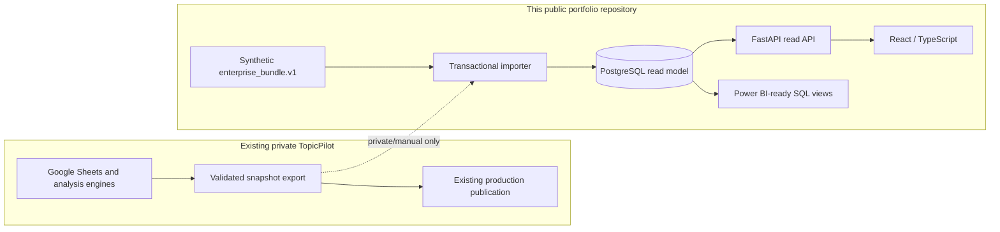
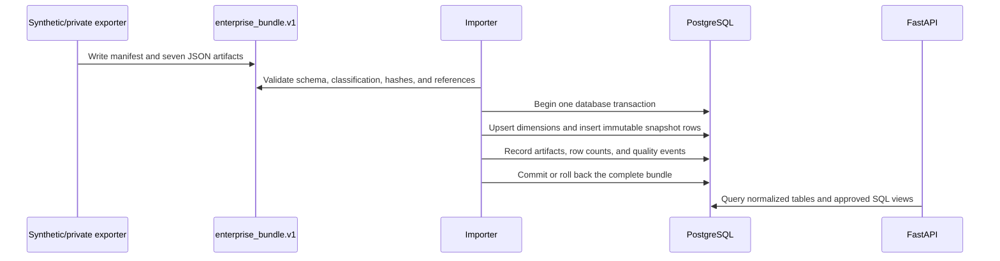

# TopicPilot Platform

TopicPilot Platform is a public, synthetic-data portfolio implementation of an
enterprise read platform for market-theme research. It demonstrates how a
spreadsheet-driven workflow can be migrated safely to PostgreSQL, FastAPI, and
React without a big-bang cutover.

> **Demo data only:** every fixture in this repository is synthetic. The UI and
> API are educational software demonstrations, not financial advice, trading
> signals, or a source of live market data.

## What this project demonstrates

- A PostgreSQL 16 read model with versioned Alembic migrations.
- Transactional, hashed, and idempotent `enterprise_bundle.v1` ingestion.
- Read-only FastAPI endpoints with generated OpenAPI documentation.
- A React and TypeScript dashboard using the API rather than direct Sheet reads.
- Docker Compose orchestration for database, migrations, seed, API, and web.
- CI checks for linting, tests, empty-database migration, OpenAPI drift,
  container smoke testing, and accidental secrets.
- SQL views designed for both the web UI and a later Power BI report.
- Explicit data lineage, public-data boundaries, parity checks, and runbooks.

## Five-minute quick start

### Prerequisites

- Docker Desktop with Compose v2
- Git
- Approximately 2 GB of free memory for the local stack

### Start the complete synthetic demo

```bash
git clone https://github.com/Xiezhou0828/topicpilot-platform.git
cd topicpilot-platform
cp .env.example .env
docker compose up --build
```

The first run performs four ordered steps:

1. PostgreSQL starts and passes `pg_isready`.
2. Alembic migrates an empty database.
3. The synthetic `enterprise_bundle.v1` fixture is imported once.
4. FastAPI and the React site start only after their dependencies are healthy.

Open these local addresses:

- Web demo: `http://localhost:3000`
- API documentation: `http://localhost:8000/docs`
- API health: `http://localhost:8000/healthz`

Stop the stack while preserving the database:

```bash
docker compose down
```

Reset all local data and repeat migration plus seed:

```bash
docker compose down --volumes --remove-orphans
docker compose up --build
```

The repository intentionally has no root npm lockfile or JavaScript workspace
manager. Root npm scripts delegate to the independent lockfiles in `apps/web`
and `packages/api-client`.

## Architecture



The original Sheet workflow remains the formal source of truth. PostgreSQL is a
rebuildable read model until a separate governance decision is made after at
least ten consecutive trading days of parity.

### Ingestion data flow



More detail is available in the [system overview](docs/architecture/system-overview.md)
and [ERD](docs/architecture/erd.md).

## Repository layout

```text
apps/web/                 React/TypeScript frontend and its own npm lockfile
services/api/             FastAPI, SQLAlchemy, Alembic, and ingestion code
packages/api-client/      Committed OpenAPI contract/generated TypeScript client
fixtures/demo/            Synthetic public enterprise bundle
fixtures/schema/          JSON Schema contract
infra/                    Container definitions and validation helpers
docs/                     Architecture, API, data, operations, security, and BI
compose.yaml              Reproducible local stack
render.yaml               Render blueprint for the FastAPI service only
```

## Development and test commands

### Backend

```bash
python -m venv .venv
# Activate .venv for your shell, then:
python -m pip install -e "services/api[dev]"
cd services/api
alembic upgrade head
pytest
ruff check . ../../infra/scripts
```

Set `DATABASE_URL` to a disposable PostgreSQL database before migrations and
tests. SQLite is not a supported substitute because the schema uses PostgreSQL
features such as JSONB.

### Frontend

```bash
npm ci --prefix apps/web
npm run lint --prefix apps/web
npm test --prefix apps/web
npm run build --prefix apps/web
```

### Containers and contract

```bash
docker compose config
bash infra/scripts/compose-smoke.sh
python infra/scripts/check_openapi_drift.py \
  --app topicpilot_api.main:app \
  --baseline packages/api-client/openapi.json
```

## API and analytics

The v1 surface is anonymous and read-only. Important endpoints include stocks,
topics, six stable strategy identifiers (`MAS`, `MAV`, `TMC`, `BB`, `PB`, and
`KD`), 14-day topic rotation, strategy performance, and data status.

- [API usage guide](docs/api/api-guide.md)
- [Bundle contract](docs/data/enterprise-bundle-v1.md)
- [Data dictionary](docs/data/data-dictionary.md)
- [Power BI implementation specification](docs/bi/power-bi-spec.md)

## Deployment model

- **Database:** a Neon PostgreSQL database supplied through `DATABASE_URL`.
- **API:** Render builds `infra/docker/api.Dockerfile`; auto-deploy is disabled
  and the protected manual workflow triggers deployment.
- **Web:** the existing vinext starter is validated and handed to Sites. Runtime
  values are managed by the hosting surface, not committed to the repository.

Render free services can sleep while idle. The public UI must treat an initial
API timeout as a cold start, show a neutral “service waking up” state, and retry
with a bounded backoff. See the [deployment guide](docs/operations/deployment.md).

No deployed URL is committed here. Add a verified demo URL only after the
deployment owner has completed the security and data-policy checklist.

## Documentation map

- [Architecture and trust boundaries](docs/architecture/system-overview.md)
- [OpenAPI-generated client decision](docs/architecture/ADR-002-openapi-generated-client.md)
- [Operations runbook](docs/operations/runbook.md)
- [Deployment handoff](docs/operations/deployment.md)
- [Ten-day parity procedure](docs/operations/parity-runbook.md)
- [Public data and licensing policy](docs/policies/public-data-and-licensing.md)
- [Security controls](docs/security/security-controls.md)
- [Screenshot capture checklist](docs/assets/screenshots/README.md)

## Portfolio and interview framing

This project is strongest when presented as an incremental platform migration,
not as a stock-picking product. A concise interview explanation is:

> I kept the existing workflow running and introduced a parallel PostgreSQL
> read model. I defined a versioned data contract, made ingestion transactional
> and idempotent, exposed a typed read API, connected a React client, and added
> reproducible containers, CI, deployment controls, data licensing boundaries,
> and parity evidence before any source-of-truth change.

Useful interview walkthroughs:

1. Explain why the migration is parallel rather than a rewrite.
2. Demonstrate a fresh-clone Compose startup and repeated no-op import.
3. Trace one stock or strategy row from bundle hash to API response.
4. Show a failing contract or foreign-key import rolling back completely.
5. Explain how one SQL analytics contract serves React and Power BI.

## License and responsible use

Source code is available under the [MIT License](LICENSE). That license does not
grant rights to third-party datasets, trademarks, news text, or market feeds.
Public fixtures are synthetic and independently licensed as part of this
repository. Review [SECURITY.md](SECURITY.md) before reporting a vulnerability.
