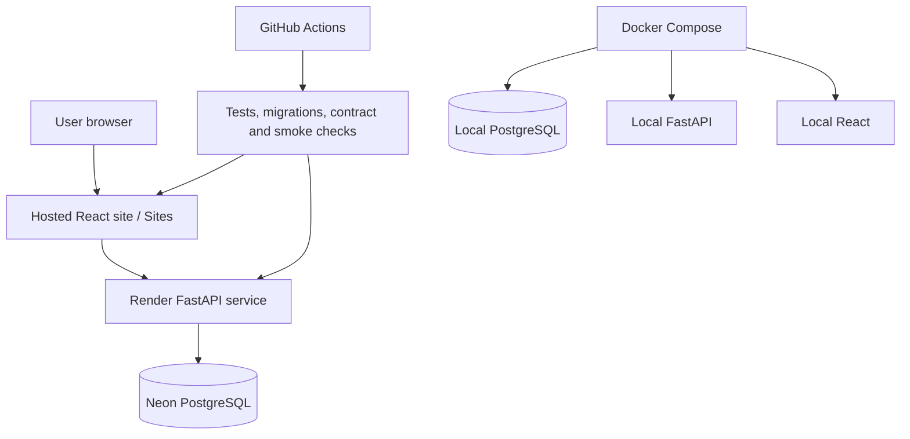

# 10 — Deployment Architecture

> The detailed production data authority, provider boundaries, secret classes,
> acceptance contract, and current implementation status live in [TopicPilot
> V2 Production Data Architecture](TOPICPILOT_V2_PRODUCTION_DATA_ARCHITECTURE.md).
> This chapter remains the concise container/topology view.

## Environments

- **Local:** Compose orders PostgreSQL, migration, synthetic import, API and web after health checks.
- **Public:** the existing web deployment consumes the FastAPI service when configured; synthetic fallback remains labelled.
- **API hosting:** Render; **database:** Neon PostgreSQL.
- **CI:** migration, lint, tests, OpenAPI drift, container smoke and secret checks.

Free-tier services may sleep. The UI distinguishes healthy, ready, warming,
unavailable and stale states. **Open Question:** production backup, retention,
alerting and recovery objectives are not defined in the current documents.
