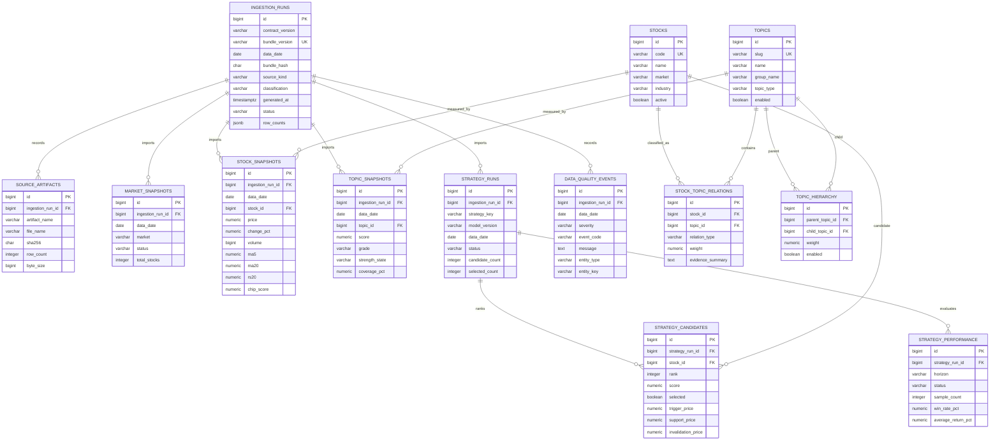

# Entity relationship diagram

The diagram describes the PostgreSQL v1 read model. Dimension tables use stable
natural identifiers such as stock code and topic slug. Snapshot facts remain
traceable to one `ingestion_runs` row.

The exact SQL, constraints, and indexes are authoritative in the Alembic
migrations. This diagram is the review-oriented logical representation.
