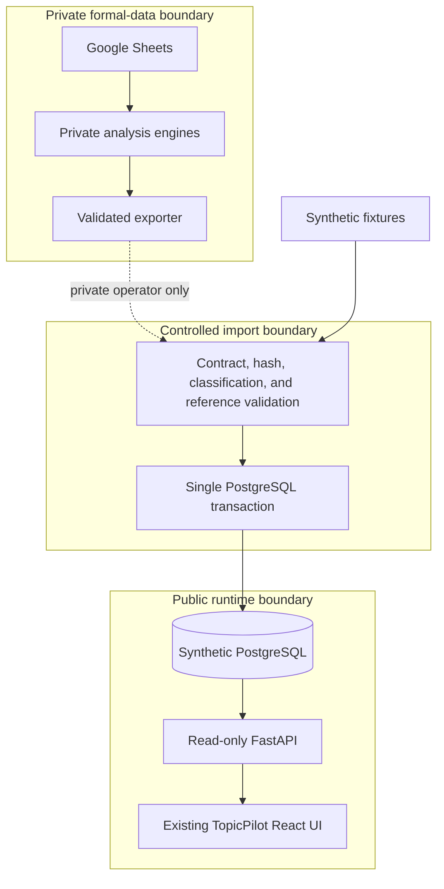

# System architecture and trust boundaries

## Purpose

TopicPilot Platform is an independently deployable, public portfolio system. It
models the read side of the private TopicPilot workflow while keeping the
existing Google Sheets, Apps Script, Python engines, R2 publication, and website
unchanged.

## Generation labels

### Current Production (`LEGACY / V1`)

Google Sheets remains the formal source of truth. Apps Script, private Python
engines, R2 publication, and the existing daily workflow continue to operate.

### Next Architecture (`NEXT / V2`)

This repository develops a rebuildable PostgreSQL read model, FastAPI read API,
and the original TopicPilot React UI connected through a new data adapter. It is
not a second product dashboard and it does not replace the production Sheet
before parity and an explicit cutover decision.

## Components

| Component | Responsibility | May write formal data? |
|---|---|---:|
| Existing TopicPilot | Maintains formal Sheet data and validated snapshots | Yes, outside this repository |
| Bundle exporter | Produces a versioned, classified artifact set | No |
| Bundle validator/importer | Verifies hashes and references, then performs one transaction | PostgreSQL read model only |
| PostgreSQL | Rebuildable normalized dimensions, snapshots, lineage, and analytics views | No formal-system writes |
| FastAPI | Anonymous read API, health, readiness, and OpenAPI | No |
| Existing React frontend | Original TopicPilot UI; only the centralized snapshot adapter changes | No |
| Power BI | Optional analysis client for the approved SQL views | No |

## Trust boundaries

Private files, private URLs, credentials, holdings, licensed quotes, and raw
news text must not cross into the public repository or deployment. Production
API requests never reach Google Sheets.

The public platform does not introduce a replacement dashboard. The existing
`/`, `/topics`, `/watchlist`, `/favorites`, `/guide`, `/studio`, and
`/stocks/:code` routes remain the user interface. `SnapshotProvider` first
requests `/api/v1/snapshot/latest` and uses the same-version synthetic bundle
only as the labelled public fallback.

## Availability model

The public environment is portfolio infrastructure, not a high-availability
service. PostgreSQL and the API may scale to zero or sleep on free tiers. The UI
must distinguish these states:

- **Healthy:** `/healthz` responds and the process is alive.
- **Ready:** `/readyz` confirms the database and required dataset are available.
- **Warming:** the API is temporarily unavailable during a cold start; retry.
- **Unavailable:** bounded retries are exhausted; show a diagnostic action.
- **Stale:** data is readable but outside the configured freshness threshold.

## Failure behavior

- Hash mismatch, invalid contract, bad foreign key, or illegal classification:
  reject the entire bundle before publication.
- Database error during import: roll back all records for that bundle.
- Repeated bundle with the same version and hash: successful no-op.
- Repeated version with a different hash: conflict requiring investigation.
- Missing numeric values: retain `NULL`; never coerce them to zero.
- API database loss: liveness can remain healthy but readiness fails.

## Source-of-truth policy

PostgreSQL cannot become the formal source of truth through a code change in
this repository. That requires a separate PM decision after ten consecutive
trading days of signed-off parity evidence. See
[ADR-001](ADR-001-parallel-read-model.md) and the
[parity runbook](../operations/parity-runbook.md).
