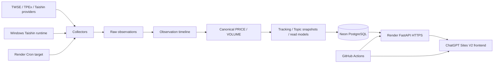

# TASK-INFRA-019｜TopicPilot V2 Production Infrastructure Report

**Generation:** `NEXT / V2`  
**Date:** 2026-08-12  
**Status:** `BLOCKED — external production resources are not provisioned or accessible`  
**Authority:** [V2 Production Data Architecture](../architecture/TOPICPILOT_V2_PRODUCTION_DATA_ARCHITECTURE.md)  
**Related:** [TASK-DEPLOY-017](TASK-DEPLOY-017_PUBLIC_FASTAPI_ORIGIN_AND_V2_SITES_RUNTIME_INTEGRATION.md)

This report records the implementation audit requested by TASK-INFRA-019. It
separates repository evidence from external-control-plane claims and does not
promote a synthetic fixture, local container, or guessed Render hostname to
production authority.

The manual UI procedure is maintained separately in [TASK-INFRA-019 Render
Manual Provisioning Handoff](TASK-INFRA-019_RENDER_MANUAL_PROVISIONING_HANDOFF.md).
That handoff is the operator-facing source for the first Web Service form and
does not imply that the service has already been created.

## 1. Executive Summary

The intended production architecture is clear and is now recorded as a named
canonical specification: Neon PostgreSQL → Render FastAPI/Cron → GitHub Actions
→ ChatGPT Sites, with the private Taishin intraday boundary retained on
Windows. The repository contains the V2 migrations, FastAPI read models,
frontend formal clients, and a deployment workflow with formal API/CORS gates.

The infrastructure is not currently deployable from this environment. There is
no accessible production Neon connection, no verified Render FastAPI service or
deploy hook, no GitHub production environments, and no Sites API base. The
Render blueprint has now been corrected to run migrations and Uvicorn without
importing `/fixtures/demo`; the external service still cannot be claimed as
deployed or formal-data-backed. The public Sites pages therefore remain
correctly unavailable or Preview.

The user has since indicated that Neon/Render resources were supplemented, but
that external state is not visible to this connected session: the Render and
Neon dashboards resolve to login pages, GitHub still reports zero repository
environments, and the Sites connector still reports only the original demo
flag. This report therefore keeps production status fail-closed until an
origin, database readback, and deployment-control evidence are observable here.

## 2. Pre-implementation Audit

| Audit item | Evidence | Result |
|---|---|---|
| PostgreSQL schema | Alembic/SQLAlchemy source and migrations | Repository present; live DB not reachable. |
| Migration authority | `services/api/alembic/versions/` | Head `0024_task_be_007_topic_snapshots`. |
| Current `DATABASE_URL` | environment/config inspection | No production value; local default points to Compose host `postgres`. |
| Local DB/runtime | listener and Docker checks | No 5432/8000 listener; Docker Linux engine pipe unavailable. |
| Production Neon | repository/GitHub/Sites inspection | No connection or project evidence available. |
| Render service | `render.yaml`, public hostname check | Blueprint exists; candidate hostname returns 404. |
| Demo import | `render.yaml` command and `fixtures/demo` | Removed from the Render production startup command; fixture remains non-production. |
| FastAPI startup | `infra/docker/api.Dockerfile`, `render.yaml` | Uvicorn command is present; formal deployment is not proven. |
| GitHub production environments | `gh api .../environments` | `total_count=0`. |
| Sites environment | Sites connector | Only `NEXT_PUBLIC_ENABLE_DEMO_FALLBACK=true`; API base absent. |
| External-resource visibility | Render/Neon dashboard navigation and current connector state | Both dashboards require sign-in in this session; no service/project evidence was exposed. |
| API base injection | workflow/layout/data clients | Build-time `PUBLIC_API_BASE_URL` → `NEXT_PUBLIC_API_BASE_URL`; redeploy required. |
| Taishin runtime | TASK-LIVE-002 / TASK-BE-009 reports | Host capability verified; private deployment and next live validation remain open. |
| Daily collection owner | TASK-BE-009 | Windows task exists and is Ready; status `PARTIALLY_READY`, never-run result recorded. |
| Secrets | GitHub repo/environment and local env inspection | No production secrets accessible. |
| Backup/recovery | architecture/deployment docs | Requirement identified; production drill/evidence absent. |

## 3. Architecture Decisions

The following boundaries are recorded as the TASK-INFRA-019 production
architecture, without claiming that the corresponding external services are
active:

- formal V2 data authority: Neon PostgreSQL;
- public API authority: Render-hosted FastAPI over formal read models;
- post-close scheduler target: approved Render Cron or explicitly approved
  equivalent; current repository evidence is a Windows Task Scheduler owner,
  not a Render Cron resource;
- intraday Taishin runtime: Windows host boundary until a private Linux/runtime
  migration is approved;
- deployment control plane: protected GitHub Actions environments;
- frontend authority: FastAPI only in production;
- production Preview fallback: forbidden as a formal identity authority;
- V1 Google Sheets/R2/snapshot workflow: separate legacy boundary.

The architecture specification intentionally does not change score, grade,
lifecycle, recommendation, Favorites, or UI semantics.

## 4. Architecture Diagram



The diagram expresses intended authority and data movement, not a claim that
each external node is currently provisioned.

## 5. Neon Provisioning

Required before production activation:

- TLS-enabled pooled PostgreSQL connection;
- least-privilege application role where supported;
- `DATABASE_URL` stored only in Render/GitHub protected secret storage;
- migration-compatible schema and connection-pooling limits;
- timezone/as-of-date policy aligned with `Asia/Taipei` trading semantics;
- backup/PITR and restore procedure.

Current result: **BLOCKED**. No production Neon URL, project, branch, role, or
backup evidence is available. The local default `DATABASE_URL` references the
Compose hostname `postgres`, which is not resolvable outside the Compose
network.

## 6. Migration Status

`alembic heads` returned:

```text
0024_task_be_007_topic_snapshots (head)
```

`alembic current` could not connect because the configured local Compose host
`postgres` was unavailable. No migration was run, no schema was changed, and no
production migration drift can be claimed either way. A real Neon connection
is required for the migration parity check.

## 7. Formal Data Bootstrap / Migration

The prior FE-BE reports provide local evidence of:

- 130 enabled topic identities;
- 507 active formal TPE/TWO stock identities;
- 506 priced rows and one null-price formal identity;
- 6806 retained as an identity even when price is unavailable.

This run did not reconnect to that PostgreSQL instance. The checked-in
`fixtures/demo` files are synthetic and contain the four-row Preview universe;
they are not a valid production bootstrap for the requested formal counts.

The required production sequence is migration → formal identity/bootstrap or
approved import → canonical/read-model reconciliation → API acceptance. Any
unknown lineage, migration drift, or count mismatch is a stop condition.

## 8. Render FastAPI

`render.yaml` defines:

- web service `topicpilot-api`, Docker, Oregon, free plan, `/readyz`;
- worker `topicpilot-live`, Docker, Oregon, starter plan;
- `DATABASE_URL` and CORS origins as externally supplied variables.

The web command now runs `alembic upgrade head` and then Uvicorn. It does not
import a bundled fixture. This is the required formal-only startup boundary,
but it must not be treated as active production until the approved Neon
database, formal bootstrap/reconciliation, and Render service are supplied.

The candidate `https://topicpilot-api.onrender.com` was checked on 2026-08-12:

| Route | Result |
|---|---:|
| `/healthz` | 404 |
| `/readyz` | 404 |
| `/openapi.json` | 404 |

No Render service control-plane evidence or deploy hook was available.

## 9. CORS

FastAPI source uses explicit `cors_origins`, `allow_credentials=False`, GET
methods, and explicit `Accept`/`Content-Type` headers. The required production
origin is:

```text
https://topicpilot-platform.game0962046460.chatgpt.site
```

Production CORS is **not verified** because no public FastAPI origin exists.
The updated release workflow will send an OPTIONS preflight and require an
exact `Access-Control-Allow-Origin` match before packaging the frontend.

## 10. Render Cron

The architecture target describes a Taiwan trading-day post-close job at
14:40 Asia/Taipei (with provider/calendar gates and idempotent persistence).
The checked-in `render.yaml` has a long-running worker, not a `type: cron`
service. The existing operational report identifies
`TopicPilot_V2_Daily_Close_1440` as the Windows Task Scheduler owner, Ready with
next run 2026-08-12 14:40, but `LastTaskResult=267011` indicates it has never
run and the daily-close status remains `PARTIALLY_READY` because holiday
catalogue/readiness is incomplete.

No duplicate scheduler was created. A Render Cron owner requires an explicit
deployment decision and external Render access.

## 11. Taishin Windows Boundary

TASK-LIVE-002 records real Taishin capability evidence, including historical and
intraday probes and PostgreSQL/API persistence tests. It also records that the
private runtime/credentials are not present in the Docker image and that the
next-session live validation remains pending. This task preserves that
boundary; it does not move the vendor runtime into Linux or fabricate provider
data.

## 12. GitHub Environments

Read-only GitHub checks returned:

- authenticated account: `Xiezhou0828`;
- repository environments: `total_count=0`;
- repository variables/secrets: none listed;
- `deploy.yml` workflow runs: none.

The required protected environments are `production-api` and `production-web`.
They must contain only the deploy hook secret and public API-base variable
respectively, with approval rules appropriate to production.

## 13. GitHub Actions

`.github/workflows/deploy.yml` now contains the TASK-INFRA-019 deployment gate:

1. require non-empty `PUBLIC_API_BASE_URL`;
2. verify `/readyz` and `/openapi.json`;
3. verify 130 topics and 507 stocks;
4. verify a topic detail, 2330, and 6806 details;
5. verify production-origin OPTIONS/CORS;
6. run targeted formal frontend tests, lint, typecheck, and production build;
7. upload the validated Sites artifact.

It does not itself create Render/Neon resources and cannot run until the
protected environments and API origin exist.

## 14. Sites Environment

Sites project: `appgprj_6a6ce02bd75c81919ab3678ebf013c53`.

The connector returned revision 1 with only:

```text
NEXT_PUBLIC_ENABLE_DEMO_FALLBACK=true
```

`NEXT_PUBLIC_API_BASE_URL` is absent. The current saved Sites version is 37,
commit `fce3d1ba8f809446cdb7c7e4c458c077f5ca4282`. No Sites environment or
version was changed because there is no verified API origin to set.

## 15. Production `/topics` Verification

The public page currently shows the formal-unavailable state and no API base;
it does not show a formal catalog. This is correct fail-closed behavior, but
the 130-identity acceptance is **NOT_READY**.

Once the API exists, verify 130 identities, null score/grade rendering,
grade-only Topic Map behavior, unavailable lifecycle, and three low-data topic
detail routes in the real browser.

## 16. Production `/stocks` Verification

The public page currently shows `Preview` and four synthetic DEMO symbols. It
does not show 2330, 2317, TWO formal listings, or 6806. Formal 507 identity
visibility, nullable-price behavior, filters, and the formal Stock Drawer are
therefore **NOT_READY**.

## 17. DB / API / UI Reconciliation

| Layer | Expected | Current evidence | Result |
|---|---:|---|---|
| PostgreSQL topics | 130 | Prior local report; no current connection | PARTIAL |
| FastAPI topics | 130 | No verified public service; candidate 404 | FAIL |
| Public topic UI | 130 formal | unavailable state | FAIL |
| PostgreSQL stocks | 507 | Prior local report; no current connection | PARTIAL |
| FastAPI stocks | 507 | No verified public service; candidate 404 | FAIL |
| Public stock UI | 507 formal | 4 Preview rows | FAIL |

## 18. Preview Removal

Production API failure must remain unavailable/error for formal topic data and
must never silently make a synthetic identity authority. Local development may
use explicit Preview mode. The current stock page still exposes its labelled
Preview path because the API base is absent; it cannot be removed from the
public result until formal API configuration is deployed and verified.

## 19. Security / Secrets

No credentials were printed, committed, or inserted into Sites. `DATABASE_URL`
and provider credentials remain backend-only. `NEXT_PUBLIC_API_BASE_URL` is
public by design. CORS uses an allowlist; wildcard credentials are forbidden.
No temporary tunnel or browser-security workaround was used.

## 20. Backup / Recovery

Production backup, PITR, restore drill, migration rollback, retention, and
alerting are not evidenced. The repository explicitly prohibits destructive
database recovery without documented backup/evidence. No volume deletion,
PostgreSQL reset, `docker prune`, or bootstrap rerun was performed.

## 21. Observability

The API has `/healthz` and `/readyz`; live runtime and post-close reports define
run/failure/freshness concepts. Production observability remains incomplete
until the external service exposes current database readiness, latest canonical
trading date, latest topic snapshot, provider failures, and deployment revision.

## 22. Tests / Validation

Passed or verified in the current repository state:

- `docker compose config --quiet`;
- static `render.yaml` formal-only boundary check: no demo importer/path,
  `/readyz` health check, and secret-backed `DATABASE_URL`/CORS variables;
- Alembic heads readback: `0024_task_be_007_topic_snapshots`;
- targeted frontend formal tests: 11 passed;
- frontend lint: pass;
- frontend typecheck: pass when run from `apps/web`;
- frontend production build: pass;
- targeted backend readiness/API/identity tests: 9 passed, 5 PostgreSQL skips;
- CORS configuration tests: 3 passed;
- `git diff --check` for task files.

Not passed or unavailable:

- live Alembic current: no database connection;
- public API/HTTPS/CORS: no public FastAPI origin;
- public browser formal-data checks: API base absent;
- full frontend test suite: existing broader migration assertions report 55
  passed / 13 failed and remain outside this infrastructure task.

## 23. Known Limitations

- The Render blueprint and intended architecture are not proof of a deployed
  Render control-plane resource.
- Prior local 130/507 counts are historical evidence until a reachable formal
  production database is reconciled.
- Render Cron is a target, not a currently configured service.
- Taishin private runtime is not portable into the current Docker image without
  a separate approved deployment prerequisite.
- Backup/restore and production observability are not yet evidenced.

## 24. External Blockers

Required external inputs are:

1. approved Neon project/branch, TLS pooled URL, role, and backup policy;
2. exact Render FastAPI service URL and deploy hook/control access;
3. formal database bootstrap/import evidence for 130/507;
4. Render CORS origin configuration;
5. GitHub `production-api` and `production-web` environments;
6. Sites `NEXT_PUBLIC_API_BASE_URL` update authority;
7. approved Render Cron or retained Windows scheduler owner;
8. private Taishin runtime/credentials for the selected collector owner.

## 25. Remaining PM Decisions

The infrastructure boundary is recorded, but PM/Operations must still decide:

- whether post-close ownership moves from Windows Task Scheduler to Render Cron;
- the production plan/region and cold-start/SLA policy;
- Neon retention/PITR and restore objectives;
- the approved private Taishin deployment boundary;
- the cutover criteria for retiring V1 as a production authority.

These decisions do not authorize changes to Topic Score, Grade, Lifecycle,
Opportunity, Recommendation, Favorites, or UI design.

## 26. Recommended Next Step

Provision or identify the approved Neon and Render resources, then populate the
protected GitHub environments through the existing release process. Start with
public `/readyz` and formal count/detail/CORS checks; only after those pass set
the Sites API base and redeploy the same validated frontend artifact.

## Initial Audit Fixed Output (superseded by the continuation below)

```text
PRODUCTION_ARCHITECTURE_DECISION = FROZEN
PRODUCTION_DB_PROVIDER = NEON
PRODUCTION_DB = BLOCKED
PRODUCTION_FASTAPI_PROVIDER = RENDER
PRODUCTION_FASTAPI = BLOCKED
PRODUCTION_FASTAPI_HTTPS = FAIL
PRODUCTION_CORS = FAIL
POST_CLOSE_RENDER_CRON = BLOCKED
TAISHIN_WINDOWS_RUNTIME = PRESERVED
GITHUB_DEPLOYMENT_CONTROL_PLANE = BLOCKED
SITES_API_BASE = NOT_CONFIGURED
PRODUCTION_PREVIEW_FALLBACK = ACTIVE
TOPICS_DB_API_UI_RECONCILIATION = BLOCKED
STOCKS_DB_API_UI_RECONCILIATION = BLOCKED
V2_PRODUCTION_DATA_CHAIN = BLOCKED
LIFECYCLE_PRODUCTION_ACTIVATION = NO
OPPORTUNITY_PRODUCTION_ACTIVATION = NO
V1_RETIRED = NO
NEXT_TASK_MODIFIED = NO
```

## 27. Continuation after user-provisioned Render/Neon resources

The user subsequently confirmed that the Neon project and Render service were
created and supplied the public API origin:
`https://topicpilot-api.onrender.com`. This continuation used the existing
service and did not repeat Render/Neon login or create a duplicate service.

Repository revision `b8abba2` (followed by `822195f` for the image startup
guard) was pushed to `main`. Render then exposed the V2 OpenAPI routes. The
public checks at that point were:

| Check | Result | Evidence |
|---|---|---|
| `GET /healthz` | 200 | `{"status":"ok"}` |
| `GET /readyz` | 200 | `{"status":"ready"}`; pooled runtime DB reachable |
| `GET /openapi.json` | 200 | six `/api/v2/*` paths present |
| `GET /api/v1/admin/schema` | 200 | Render runtime exposes the migrated V2 table metadata |
| `GET /api/v2/topics?limit=200&offset=0` | 200 | formal read model response, `total=0`, `items=0` |
| `GET /api/v2/stocks?limit=1000&offset=0` | 200 | formal read model response, `total=0`, `items=0` |
| `/api/v2/stocks/2330`, `/api/v2/stocks/6806` | 404 | identities are not yet in this Neon project |
| `/api/v2/topics/ai-server` | 404 | formal topic identity is not yet in this Neon project |
| CORS preflight | 200 | exact Sites origin returned; `GET` only; no wildcard/credentials |

The initial 500 responses were caused by the manually created service not
running the additive Alembic startup command. The checked-in Docker image now
runs `alembic upgrade head` before Uvicorn as a safety net when a manual Render
Start Command override is absent. It remains formal-only: no `topicpilot-import`,
demo fixture, reset, or recreate path is present.

The public V2 schema is therefore ready, but the formal dataset is not. The
repository contains no approved 130-topic/507-stock production artifact; the
checked-in `fixtures/demo` bundle is synthetic and was not imported. No
production migration/import was executed from this session and no secret was
printed or committed.

The approved private input directory is available locally at
`C:\Users\acer\Desktop\題材領航\input` for operator use. A no-write dry-run
against that directory passed with `records_read=1594`, `valid=1594`, zero
rejections/conflicts/warnings, and the expected entity counts: 2 markets, 507
instruments, 130 topics, 107 hierarchy edges, and 848 instrument-topic
relations. The dry-run did not contact Neon. The protected first formal import
must be run from the same revision with the direct migration connection, for
example:

```text
$env:PYTHONPATH='services/api/src'
python infra/scripts/phase3_6_001b_legacy_import.py `
  --input 'C:\Users\acer\Desktop\題材領航\input' `
  --database-url "$env:MIGRATION_DATABASE_URL" `
  --apply
```

The command is intentionally not run here because the Neon secret is not
available to this session. It is transactional and idempotent; an operator
must review its JSON result before enabling any 130/507 public acceptance gate.

Sites production environment revision 2 now contains:

```text
NEXT_PUBLIC_API_BASE_URL=https://topicpilot-api.onrender.com
NEXT_PUBLIC_ENABLE_DEMO_FALLBACK=false
```

The existing public Sites version was redeployed. Browser smoke checks showed
`/topics` with `0 個題材` and `/stocks` with `0/0 檔`, with no Preview rows and
no CORS console error. Home and Favorites still load without a crash; their
pre-existing presentation-only content was not changed in this task.

## Current Fixed Final Output

```text
PRODUCTION_ARCHITECTURE_DECISION = FROZEN
PRODUCTION_DB_PROVIDER = NEON
PRODUCTION_DB = PARTIAL
PRODUCTION_FASTAPI_PROVIDER = RENDER
PRODUCTION_FASTAPI = PARTIAL
PRODUCTION_FASTAPI_HTTPS = PASS
PRODUCTION_CORS = PASS
POST_CLOSE_RENDER_CRON = BLOCKED
TAISHIN_WINDOWS_RUNTIME = PRESERVED
GITHUB_DEPLOYMENT_CONTROL_PLANE = BLOCKED
SITES_API_BASE = CONFIGURED
PRODUCTION_PREVIEW_FALLBACK = REMOVED
TOPICS_DB_API_UI_RECONCILIATION = PARTIAL (0/130; formal artifact absent)
STOCKS_DB_API_UI_RECONCILIATION = PARTIAL (0/507; formal artifact absent)
V2_PRODUCTION_DATA_CHAIN = PARTIAL
LIFECYCLE_PRODUCTION_ACTIVATION = NO
OPPORTUNITY_PRODUCTION_ACTIVATION = NO
V1_RETIRED = NO
NEXT_TASK_MODIFIED = NO
```

## Modified / Created / Open

- **Created:** `docs/architecture/TOPICPILOT_V2_PRODUCTION_DATA_ARCHITECTURE.md`;
  this report; `docs/reports/TASK-INFRA-019_RENDER_MANUAL_PROVISIONING_HANDOFF.md`.
- **Modified:** `render.yaml` formal-only startup/health boundary, formal
  deployment runbook, explicit `MIGRATION_DATABASE_URL` configuration,
  architecture authority index, concise deployment chapter, work-order
  register, and `.github/workflows/deploy.yml` acceptance gate.
- **Not modified:** UI, business rules, schemas, migrations, production data,
  Lifecycle, Opportunity/Recommendation, Favorites, or `NEXT_TASK`.
- **Open:** formal 130/507 production artifact and approved import execution;
  GitHub protected deployment environments; Render Cron/worker ownership;
  and production backup/restore evidence. The public API and Sites wiring are
  now present but intentionally remain partial until the formal dataset is
  imported and reconciled.
- **Worklog:** `AI_WORKLOG.md` is absent in V2 and is not created without an
  identified owner and migration plan, per repository governance.

## 28. Post-bootstrap close-out (2026-08-12)

The historical infrastructure audit above recorded the correct earlier
blocked/partial state. The user has now completed the external Neon bootstrap;
the following read-only reconciliation is the current state and supersedes the
previous empty-read-model values.

### Production authority and counts

The production schema is `topicpilot`. User-confirmed Neon counts are:

```text
instruments = 507
topics = 130
topic_hierarchy = 107
instrument_topic_relations = 848
```

The relation table is `topicpilot.instrument_topic_relations`, matching the
repository ORM and API relation projection. The original importer dry-run
remains `1594` records, all valid, with no rejected, duplicate, conflict, or
warning records.

### Public runtime reconciliation

The existing Render service remains the single public FastAPI origin:
`https://topicpilot-api.onrender.com`. Read-only checks now pass for health,
readiness, OpenAPI, CORS, topics `130/130`, stocks `507/507`, stock details
2330/6806, and formal topic detail `/api/v2/topics/ASIC`. The stock universe
contains TPE 314 and TWO 193; 6806's nullable price is preserved. Sites
production has the configured API base and demo fallback disabled; browser
checks show formal topics/stocks and formal 2330 drawer relations.

The paginated public admin readback fetched all 507 instruments, 130 topics,
and 848 relation rows with zero orphan instrument references, zero orphan topic
references, and zero duplicate relation IDs. This supplies read-only
FK/relation evidence without a production write.

No new service, database, tunnel, migration, or bootstrap path was introduced.
The production image remains formal-only and does not import `fixtures/demo`.

### Current fixed final output

```text
PRODUCTION_ARCHITECTURE_DECISION = FROZEN
PRODUCTION_DB_PROVIDER = NEON
PRODUCTION_DB = READY
PRODUCTION_FASTAPI_PROVIDER = RENDER
PRODUCTION_FASTAPI = READY
PRODUCTION_FASTAPI_HTTPS = PASS
PRODUCTION_CORS = PASS
POST_CLOSE_RENDER_CRON = BLOCKED
TAISHIN_WINDOWS_RUNTIME = PRESERVED
GITHUB_DEPLOYMENT_CONTROL_PLANE = BLOCKED
SITES_API_BASE = CONFIGURED
PRODUCTION_PREVIEW_FALLBACK = REMOVED
TOPICS_DB_API_UI_RECONCILIATION = PASS (130/130)
STOCKS_DB_API_UI_RECONCILIATION = PASS (507/507)
V2_PRODUCTION_DATA_CHAIN = READY
LIFECYCLE_PRODUCTION_ACTIVATION = NO
OPPORTUNITY_PRODUCTION_ACTIVATION = NO
V1_RETIRED = NO
NEXT_TASK_MODIFIED = NO
```

Remaining infrastructure work is operational rather than a data-chain
blocker: Render Cron ownership, private Taishin runtime ownership, protected
GitHub deployment environments, and backup/restore evidence remain separate
follow-up decisions.
