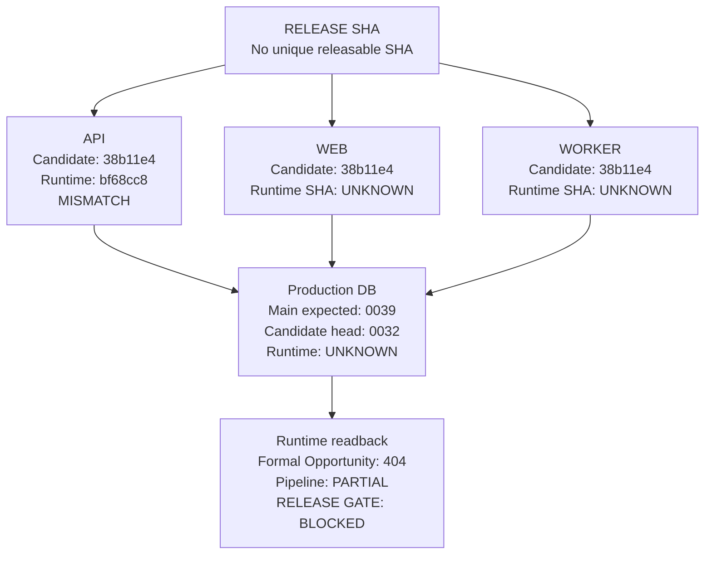

# TASK-REL-001 Exact-SHA Release-Chain and Runtime Readback

**Date:** `2026-09-13`
**Scope:** release-chain reconciliation after GOV-000 and GOV-001
**Authority:** repository, Git, migration, deployment configuration, and
public runtime evidence only
**Product feature development:** `NOT PERFORMED`

This report records whether the reconciled project state can be promoted as
one exact-SHA release. It does not reopen the archaeology in GOV-000 or the
bounded Opportunity canonicalization in GOV-001. Chat memory is not evidence.

## 1. Release result

```yaml
TASK_ID: REL-001
REL_001_STATUS: BLOCKED_RELEASE_CHAIN
MEMORY_RECOVERY: COMPLETE
CURRENT_STATE_MAP: INHERITED_FROM_GOV-000_AND_GOV-001
CANONICAL_GOVERNANCE_HEAD: 38b11e4a148e6d49092aff4fd1e485034b8d47df
CANONICAL_PRODUCT_BASELINE: origin/main@b2eaf33e0ec5f9bb72d936eb0165eb93dac3fa40
FORMAL_OPPORTUNITY_CANONICAL_COMMIT: 90c2916df4d6e25d7d5df02b4e4ecf8262b7adb4
API_RUNTIME_SHA: bf68cc8bf0a4432d7623db43f42e9219c94d7b6b
API_RUNTIME_BRANCH: origin/codex/today-production-convergence-20260913
INTENDED_API_SHA: 38b11e4a148e6d49092aff4fd1e485034b8d47df CANDIDATE_ONLY
INTENDED_WEB_SHA: 38b11e4a148e6d49092aff4fd1e485034b8d47df CANDIDATE_ONLY
INTENDED_WORKER_SHA: 38b11e4a148e6d49092aff4fd1e485034b8d47df CANDIDATE_ONLY
INTENDED_MIGRATION_HEAD: 0039_task_a9_b2_formal_correction_supersession
CANDIDATE_MIGRATION_HEAD: 0032_task_ws1_topic_lifecycle_contract_gap_closure
RUNTIME_MIGRATION_HEAD: UNKNOWN
WEB_RUNTIME_SHA: UNKNOWN
WORKER_RUNTIME_SHA: UNKNOWN
DATA_PIPELINE_STATE: PARTIAL
FORMAL_OPPORTUNITY_RUNTIME: ABSENT_404
SHADOW_OPPORTUNITY_RUNTIME: READY_SYNTHETIC
RELEASE_GATE: BLOCKED
OPERATOR_ACTION_REQUIRED: YES
OWNER_DECISION_REQUIRED: NO_FOR_PRODUCT_SEMANTICS
DEPLOY: NO
PUSH: NO
PRODUCTION_MUTATION: NO
NEXT_TASK_CHANGE: NO
ALLOW_NEW_DEVELOPMENT: GOVERNED_TASKS_ONLY
```

The exact release chain cannot be marked `RELEASE_CANDIDATE` because the
clean candidate containing the canonicalized formal Opportunity slice stops at
migration `0032`, while the reconciled main product baseline stops at `0039`.
The live API is a third, diverged Today branch. This is a lineage and release
composition gap, not evidence that a new Opportunity provider or a new
product implementation should be written.

### 1.1 Evidence-backed release chain

The intended topology is recorded below. The labels are current evidence, not
deployment instructions; a red or grey node is a release gate failure or an
unobservable value.



## 2. Evidence chain

### 2.1 Source and branch evidence

| Evidence | Exact result | State |
|---|---|---|
| Canonical checkout | branch `codex/task-ops-023a-p3c-runtime-sha-audit-20260813`, HEAD `38b11e4` | `VERIFIED` governance candidate |
| Product baseline | `origin/main@b2eaf33`; the current governance branch is `95` commits behind and `205` commits ahead of it | `VERIFIED` baseline, not the formal Opportunity candidate |
| Formal Opportunity slice | `90c2916`, source/schema/API/OpenAPI/generated-client/frontend fail-closed boundary | `CANONICALIZED / VALIDATED`, not released |
| GOV-001 sync | `25741c4` and `2665edf` | `VERIFIED` documentation lineage |
| Live API | `bf68cc8`, tip of `origin/codex/today-production-convergence-20260913` | `VERIFIED RUNTIME_ONLY` |
| Today commercial branch | `origin/codex/today-commercial-investor-release-20260912@569d2b4` | `BRANCH_ONLY` |
| A10/A9 isolated quote branch | `origin/codex/a10-a9-isolated-quote-closure-20260912@51dbe48` | `BRANCH_ONLY` |
| A9/B2 writer branch | `origin/codex/a9-b2-production-writer-closure-20260912@68600af` | `BRANCH_ONLY` |

The current canonical worktree has one tracked owner modification and 151
untracked owner-retained entries at this capture. They were not staged,
cleaned, deleted, reset, or reclassified as release evidence. The clean
verification worktree at
`C:\Users\acer\Desktop\題材領航\topicpilot-platform-gov001-verify-20260913`
was detached at the exact candidate SHA and had zero status entries before
validation.

### 2.2 Migration lineage

| Line | Highest available migration | Interpretation |
|---|---|---|
| `origin/main` | `0039_task_a9_b2_formal_correction_supersession` | Current canonical main schema authority |
| REL-001 clean candidate `38b11e4` | `0032_task_ws1_topic_lifecycle_contract_gap_closure` | Candidate is not aligned to the main schema line |
| A10/A9 branch | `0040_task_a10_recovery_checkpoint_observability.py` | Branch-only; not promoted or deployed |
| Public runtime | No public migration revision readback | `UNKNOWN / OPERATOR_REQUIRED` |

Migration `0040` is not included in the candidate, is not on `origin/main`,
and is not required by the bounded Opportunity read contract. It must not be
deployed merely to make the A10 branch appear newer. No migration was run
against a protected database during REL-001.

### 2.3 Deployment configuration

`render.yaml` has API and worker `autoDeployTrigger: off`. Both containers run
`alembic upgrade head` before starting, so a future operator promotion must
first reconcile the protected database revision and the selected source SHA.
The configuration does not expose a public worker revision endpoint. The Web
hosting file contains only an opaque Sites project identifier and no source
SHA mapping.

## 3. Clean candidate verification

The exact candidate was verified in a clean detached worktree. Dependencies
were installed from the repository lockfiles with `npm ci`; the clean
worktree did not rely on the canonical checkout's ignored `node_modules`.

| Check | Result | Qualification |
|---|---|---|
| Backend regression | `22 passed, 1 skipped` | Skip is PostgreSQL integration requiring `TEST_DATABASE_URL` or `DATABASE_URL` |
| Ruff changed backend files | `PASS` | No lint errors |
| API client generation/drift | `PASS` | `npm run check`; generated OpenAPI and Web declarations unchanged |
| Frontend build | `PASS` | Vinext build completed; `/opportunities` route included |
| Full frontend tests | `157 passed, 0 failed` | Node test suite |
| Candidate migration heads | one head: `0032...` | Clean local Alembic inspection only |
| `git diff --check` | `PASS` | Clean candidate |
| Production write/deploy | `NOT PERFORMED` | Safety boundary |

The clean checks prove the committed source boundary and its local build. They
do not prove migration compatibility with `origin/main@b2eaf33`, protected
database state, deployment provenance, or public runtime parity.

## 4. Public runtime and data readback

All values below are read-only public HTTP observations made on 2026-09-13.
HTTP 200 is not treated as formal-data validity.

| Surface | Readback | State |
|---|---|---|
| `/healthz` | HTTP 200, `gitSha=bf68cc8...` | `VERIFIED RUNTIME_ONLY` |
| `/readyz` | HTTP 200, same SHA | `VERIFIED RUNTIME_ONLY` |
| `/openapi.json` | synthetic-only description; no formal Opportunity paths | `VERIFIED` |
| `/api/v2/home` | `asOf=2026-09-09`, `home-v2.formal.v1`, publication `PUBLISHED`; opportunities `UNAVAILABLE / OPTIONAL_SECTION_NOT_FORMAL` | `PARTIAL` |
| `/api/v2/topics?limit=1` | total `87`; first Topic lifecycle `NOT_AVAILABLE`, transition `HOLD_FORMAL_GATE` | `PARTIAL / BLOCKED` |
| `/api/v2/topic-snapshots?latest=true&limit=1` | total `92`, date `2026-09-09`, `scoreStatus=DEFERRED` | `PARTIAL` |
| `/api/v2/stocks?limit=1` | total `555`; first EOD date `2026-09-11`, `adjustmentState=UNKNOWN` | `PARTIAL` |
| `/api/v1/operations/live/status` | `POST_CLOSE`, requested `552`, success `347`, failure `205`, retry `240`, provider available, freshness `PARTIAL`, `PROVIDER_REQUEST_FAILED` | `PARTIAL / BLOCKED` |
| `/api/v1/opportunities/shadow` | `READY`, `SHADOW`, `FIXTURE/SYNTHETIC`, `asOf=2026-08-12` | `VERIFIED SHADOW ONLY` |
| `/api/v2/opportunities` | HTTP 404 | `FORMAL ROUTE NOT DEPLOYED` |
| `/api/v1/admin/dashboard` | HTTP 500 | runtime migration revision not observable through this endpoint |
| `/api/v1/admin/schema` | HTTP 200, metadata-derived table list | schema surface only; not migration revision proof |
| Public Web `/opportunities` | current readback timed out; prior GOV-001 readback was HTTP 200 with opaque deployment version `318c2e47-a67c-4724-bde0-bf75d8be14c0` | `UNKNOWN / NOT EXACT-SHA VERIFIED` |

Today Signals are not promoted by this readback: the current Home response has
an empty `dailyFocus.signals` array and an empty `marketPulse` array, while a
four-item signal catalog is present. This is a bounded catalog/empty-result
state, not evidence of a fully populated market-signal pipeline.

## 5. Workstream state map

The following states preserve the GOV-000/GOV-001 history and add only the
release/runtime evidence observed here.

| Workstream | Current evidence-based state | Release interpretation |
|---|---|---|
| A10 EOD / POST_CLOSE / quote resilience | `IN_PROGRESS + BLOCKED` | Branch closure and partial runtime evidence exist; no exact promoted SHA or complete provider readback |
| A9 correction / A9-B2 writer | `IN_PROGRESS + BLOCKED` | Migration foundation is on main; writer/13:35 activation is branch/protected-operator work |
| B2 Lifecycle V1.3 | `BLOCKED` | Runtime stage-bearing authority is absent; Topic remains fail-closed |
| B3 | `UNKNOWN / NOT_STARTED` | No implementation or promotion evidence |
| B4 | `UNKNOWN / NOT_STARTED` | No implementation or promotion evidence |
| Today / Market Signals | `PARTIAL + IN_PROGRESS` | Live branch behavior exists, but it is not the canonical main release line |
| Topic Recovery | `PARTIAL` | Formal identity/snapshot reads exist; derived score, grade, lifecycle, ranking, breadth, leadership, and concentration remain unavailable/deferred |
| Opportunity shadow | `VERIFIED SHADOW` | Synthetic fixture/research boundary only |
| Opportunity formal page | `CANONICALIZED + VALIDATED / NOT RELEASED` | Exact local contract exists at `90c`; no formal provider, persistence, or deployed route |
| FUND-001 | `PROPOSED / OWNER_DECISION_REQUIRED` | Initiation packet exists; no FinMind provider or formal institution-flow implementation |
| V1 legacy bridge | `LEGACY_STILL_ACTIVE` | Not abandoned; retirement requires V2 parity and explicit cutover |

No item is labelled `ABANDONED` by age, duplication, dead-looking code, or
absence from the live runtime. No new `SUPERSEDED` decision was created by
REL-001. The branch-only migration `0040` is `NOT_CANONICAL / NOT_RELEASED`,
not silently treated as superseded.

## 6. Incomplete, orphan, and conflict inventory

| Finding | State | Required handling |
|---|---|---|
| Candidate formal Opportunity route vs main migration line | `BLOCKED_COLLISION` | Create a main-derived release candidate or explicitly exclude the formal slice from the selected release scope; do not deploy either line as-is |
| Protected DB revision | `UNKNOWN` | Operator-only readback of `topicpilot.alembic_version`; no write until source/migration selection is approved |
| API exact runtime | `MISMATCH` | Runtime is `bf68cc8`, not candidate `38b11e4` |
| Web exact runtime SHA | `UNKNOWN` | Sites exposes only an opaque deployment version and current request timed out |
| Worker exact runtime SHA | `UNKNOWN` | Obtain service revision/log evidence from operator |
| POST_CLOSE/provider completeness | `PARTIAL` | Preserve failure and retry counts; no pipeline PASS claim |
| Formal Opportunity provider | `BLOCKED` | Existing unavailable provider remains fail-closed; no algorithm or data authority is authorized |
| Owner-retained dirty/untracked artifacts | `ACTION_REQUIRED` | Preserve and classify; no blanket cleanup or staging |
| Historical worktrees | `OWNER_DISPOSITION_REQUIRED` | 28 worktrees are registered, including 27 non-canonical worktrees; no worktree is deleted by this task |

Repository hygiene is therefore `ACTION_REQUIRED`, not `PASS`:

```yaml
REPOSITORY_HYGIENE_STATUS: ACTION_REQUIRED
WORKTREE_COUNT_TOTAL: 28
NON_CANONICAL_WORKTREE_COUNT: 27
STALE_WORKTREE_COUNT: NOT_PROVEN
ORPHANED_WORKSTREAM_COUNT: NOT_PROVEN
UNATTRIBUTED_DIRTY_COUNT: 152_CAPTURED_ENTRIES
LOCAL_ONLY_COMMIT_COUNT: 205_against_origin_main
REMOTE_ONLY_COMMIT_COUNT: 95_against_origin_main
```

The counts identify work requiring owner disposition; they do not authorize
cleanup, branch deletion, reset, force-push, or merge.

## 7. Operator packet

`OPERATOR_ACTION_REQUIRED=YES` is a release prerequisite, not an instruction
to execute during this task.

1. Select and record the owner-approved release composition. The current
   evidence does not provide one SHA containing both the `origin/main` `0039`
   migration line and the canonicalized formal Opportunity slice.
2. Against the protected database, perform a read-only revision check of
   `topicpilot.alembic_version`. Record the exact revision and database target.
   Do not run `alembic upgrade head` until the selected source SHA, expected
   migration head, backup/rollback path, and operator approval are recorded.
3. For API promotion, deploy only the selected exact SHA and require
   `/healthz.gitSha` and `/readyz.gitSha` to equal it. A 200 response without
   the exact SHA is not accepted.
4. For the worker, capture the service revision or startup provenance and
   prove it equals the selected SHA. Then read back scheduler mode, one
   POST_CLOSE run, provider outcome, freshness, retries, and failure details.
5. For Web, deploy the selected exact SHA and capture a source-SHA mapping.
   The current opaque Sites deployment version alone is insufficient.
6. Re-read formal Opportunity, Topic, Today, Stock, and operations endpoints
   after promotion. Formal data must remain fail-closed where authority is
   absent; do not turn shadow/fixture/synthetic results into formal data.

## 8. Safe next task

```yaml
TASK_ID: REL-002
STATUS: RECOMMENDED_ONLY
OWNER: Release owner / operator
GOAL: Reconcile one main-derived exact-SHA release composition and its migration head
ALLOWED: owner decision on release scope, commit-preserving reconciliation, clean-candidate verification, protected read-only revision check, exact runtime readback
FORBIDDEN: new Opportunity algorithm, new Topic semantics, new Signals implementation, FUND implementation, migration 0040 promotion by assumption, deployment without exact-SHA evidence, NEXT_TASK mutation
INPUTS: origin/main@b2eaf33, formal Opportunity commit 90c2916, REL-001 report, protected DB/runtime operator evidence
STOP_IF: selected SHA and migration head cannot be uniquely proven, or protected runtime provenance remains unavailable
```

This recommendation does not change the owner-controlled `NEXT_TASK`. No
FUND, Signals, Topic, or Opportunity feature implementation is opened by
REL-001.

## 9. Governance consistency and safety statement

The following governance entries were synchronized after this readback:

- `PROJECT_CONTEXT.md` — startup checkpoint and release-chain status;
- `docs/ROADMAP.md` — execution routing and next release dependency;
- `docs/DOCUMENTATION_INDEX.md` — report navigation;
- `docs/WORK_ORDERS.md` — REL-001 scope, evidence, and blocked release state;
- this report — authoritative exact-SHA release/readback evidence for REL-001.

Existing GOV-000 and GOV-001 reports were not rewritten or overwritten. No
existing decision was changed. No supersession relation was invented. No
application code, schema, migration, runtime configuration, deployment, data,
branch, worktree, or `NEXT_TASK` was changed by REL-001.

```yaml
GOVERNANCE_DOC_SYNC: PASS_AFTER_LINK_CHECK
MEMORY_RECOVERY: COMPLETE
RELEASE_READBACK: COMPLETE_WITH_BLOCKERS
RELEASE_GATE: BLOCKED
NEW_DEVELOPMENT_AUTHORIZATION: GOVERNED_TASKS_ONLY
```
